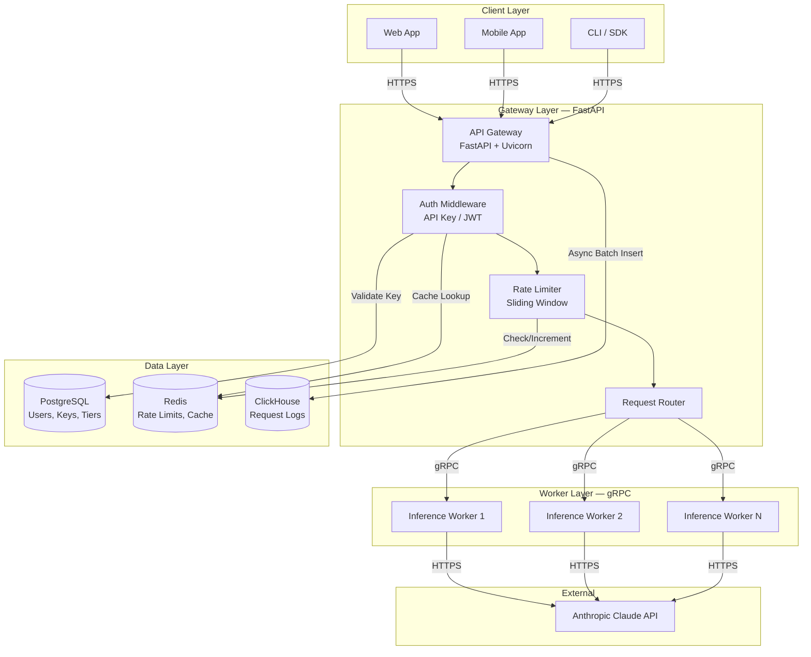
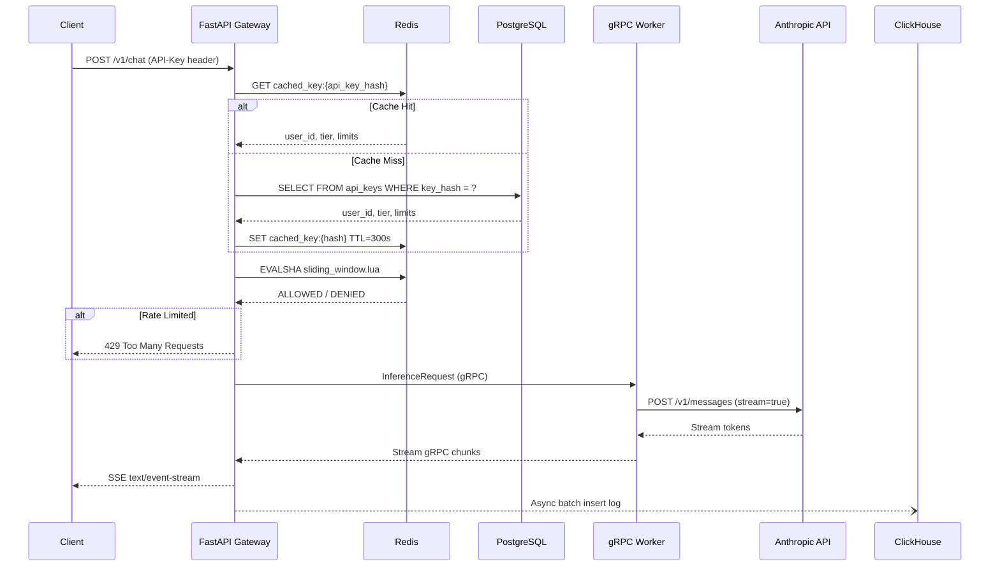
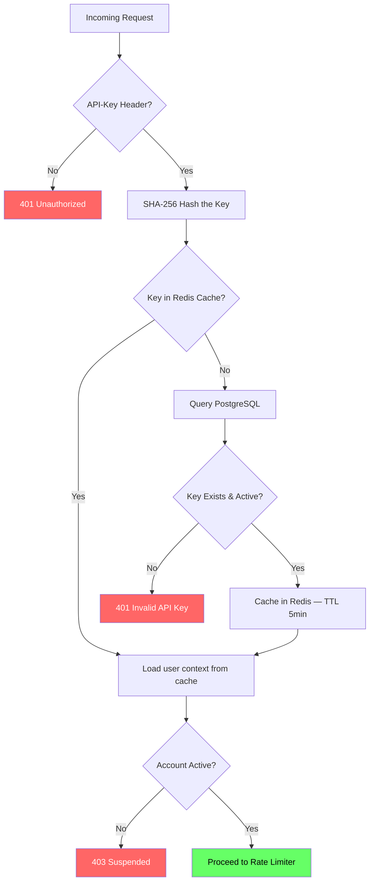
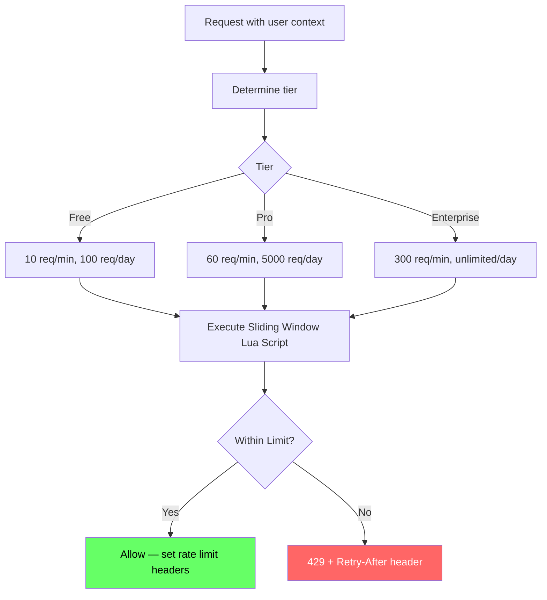

# LLM Inference Gateway

A self-hostable, production-grade API gateway for Anthropic Claude models. Provides authentication, rate limiting, streaming inference, and analytics in a single deployable stack.

## Overview

Organizations deploying LLMs internally need a unified control plane between their users and the model API — handling auth, billing, rate limiting, and observability in one place. This gateway solves that problem.

The LLM Inference Gateway acts as a reverse proxy that sits in front of Anthropic's Claude API and provides:

- **Multi-tenant access control** — Register users, issue API keys, and enforce per-tier usage limits without touching the underlying model provider.
- **Cost visibility** — Track token usage, estimated costs, and latency per user, per model, per day with real-time analytics powered by ClickHouse.
- **OpenAI-compatible API format** — Drop-in replacement for applications already using the OpenAI chat completions format, making migration seamless.
- **Scalable inference layer** — The gateway delegates actual model calls to gRPC workers that can be horizontally scaled. Workers include circuit breakers and retry logic to handle upstream failures gracefully.
- **Streaming-first design** — Server-Sent Events (SSE) deliver tokens to clients in real-time as they're generated, minimizing perceived latency.
- **One-command deployment** — The entire stack (gateway, worker, PostgreSQL, Redis, ClickHouse) launches with a single `podman compose up --build` command.

### Who is this for?

- Teams that want to share a single Anthropic API key across multiple developers while maintaining per-user rate limits and usage tracking.
- Platform engineers building internal LLM services who need auth, observability, and cost attribution out of the box.
- Developers looking for a reference implementation of a production-grade Python microservices architecture using FastAPI, gRPC, Redis, PostgreSQL, and ClickHouse.

## Architecture



### Request Flow



### Authentication Flow



### Rate Limiting — Sliding Window



## Features

- **API Key Authentication** — SHA-256 hashed keys with Redis cache (5min TTL)
- **Per-Tier Rate Limiting** — Redis sliding window (sorted sets + Lua script)
- **Streaming Inference** — SSE (Server-Sent Events), OpenAI-compatible format
- **gRPC Workers** — Scalable inference layer with circuit breaker + retry
- **Analytics** — Async batched logging to ClickHouse, materialized views
- **Usage Dashboards** — Per-user breakdowns (tokens, cost, latency)

## Quick Start

### Prerequisites

- [Podman](https://podman.io/) 4.0+ with [podman-compose](https://github.com/containers/podman-compose) 1.0+
- An [Anthropic API key](https://console.anthropic.com/)

### Setup

```bash
# Clone
git clone https://github.com/bhanreddy1973/LLM-Inference-Gateway.git
cd LLM-Inference-Gateway

# Configure environment
cp .env.example .env
# Edit .env and add your ANTHROPIC_API_KEY

# Generate proto stubs
make proto

# Start all services
podman compose up --build
```

The gateway will be available at `http://localhost:8000`.

### Verify

```bash
# Health check
curl http://localhost:8000/v1/health

# Readiness (checks all dependencies)
curl http://localhost:8000/v1/health/ready
```

## Usage

### 1. Register a User

```bash
curl -X POST http://localhost:8000/v1/auth/register \
  -H "Content-Type: application/json" \
  -d '{"email": "user@example.com", "password": "securepass123", "name": "Test User"}'
```

### 2. Login (Get JWT)

```bash
curl -X POST http://localhost:8000/v1/auth/login \
  -H "Content-Type: application/json" \
  -d '{"email": "user@example.com", "password": "securepass123"}'
```

### 3. Create an API Key

```bash
curl -X POST http://localhost:8000/v1/keys \
  -H "Authorization: Bearer <jwt_token>" \
  -H "Content-Type: application/json" \
  -d '{"name": "My First Key"}'
```

Save the returned `key` — it's only shown once.

### 4. Chat Completion

```bash
# Non-streaming
curl -X POST http://localhost:8000/v1/chat \
  -H "X-API-Key: sk-live-..." \
  -H "Content-Type: application/json" \
  -d '{
    "model": "claude-sonnet-4-20250514",
    "messages": [{"role": "user", "content": "Hello!"}],
    "max_tokens": 256
  }'

# Streaming (SSE)
curl -X POST http://localhost:8000/v1/chat/stream \
  -H "X-API-Key: sk-live-..." \
  -H "Content-Type: application/json" \
  -d '{
    "model": "claude-sonnet-4-20250514",
    "messages": [{"role": "user", "content": "Hello!"}],
    "max_tokens": 256
  }'
```

### 5. Check Usage

```bash
curl http://localhost:8000/v1/usage \
  -H "Authorization: Bearer <jwt_token>"
```

## API Endpoints

| Method | Endpoint | Auth | Description |
|--------|----------|------|-------------|
| POST | `/v1/auth/register` | None | Register user |
| POST | `/v1/auth/login` | None | Get JWT token |
| POST | `/v1/keys` | JWT | Create API key |
| GET | `/v1/keys` | JWT | List API keys |
| DELETE | `/v1/keys/{id}` | JWT | Revoke key |
| POST | `/v1/chat` | API Key | Chat completion |
| POST | `/v1/chat/stream` | API Key | Streaming chat (SSE) |
| GET | `/v1/usage` | JWT | Usage summary |
| GET | `/v1/usage/analytics` | JWT | Detailed analytics |
| GET | `/v1/health` | None | Liveness probe |
| GET | `/v1/health/ready` | None | Readiness probe |

## Rate Limits

| Tier | Requests/min | Requests/day | Max Tokens |
|------|-------------|--------------|------------|
| Free | 10 | 100 | 1,024 |
| Pro | 60 | 5,000 | 4,096 |
| Enterprise | 300 | Unlimited | 8,192 |

## Tech Stack

| Component | Technology | Purpose |
|-----------|-----------|---------|
| Gateway | FastAPI + Uvicorn | API layer, auth, routing |
| Worker | gRPC + Anthropic SDK | Inference, streaming |
| Database | PostgreSQL 16 | Users, keys, tiers |
| Cache | Redis 7.2 | Rate limiting, key cache |
| Analytics | ClickHouse 24.x | Request logs, usage stats |
| Containers | Podman + Compose | Orchestration |

## Project Structure

```
├── gateway/              # FastAPI application
│   ├── routers/          # API endpoints
│   ├── middleware/       # Auth, rate limiting, logging
│   ├── services/         # Business logic
│   ├── models/           # SQLAlchemy + Pydantic
│   └── utils/            # Hashing, key generation
├── worker/               # gRPC inference worker
├── proto/                # Protocol buffer definitions
├── migrations/           # Alembic database migrations
├── scripts/              # Init SQL, seed data
└── podman-compose.yml    # Multi-service orchestration
```

## Development

```bash
# Run database migrations
cd migrations && alembic upgrade head

# Seed test data
python scripts/seed_data.py

# Generate proto stubs
make proto
```

